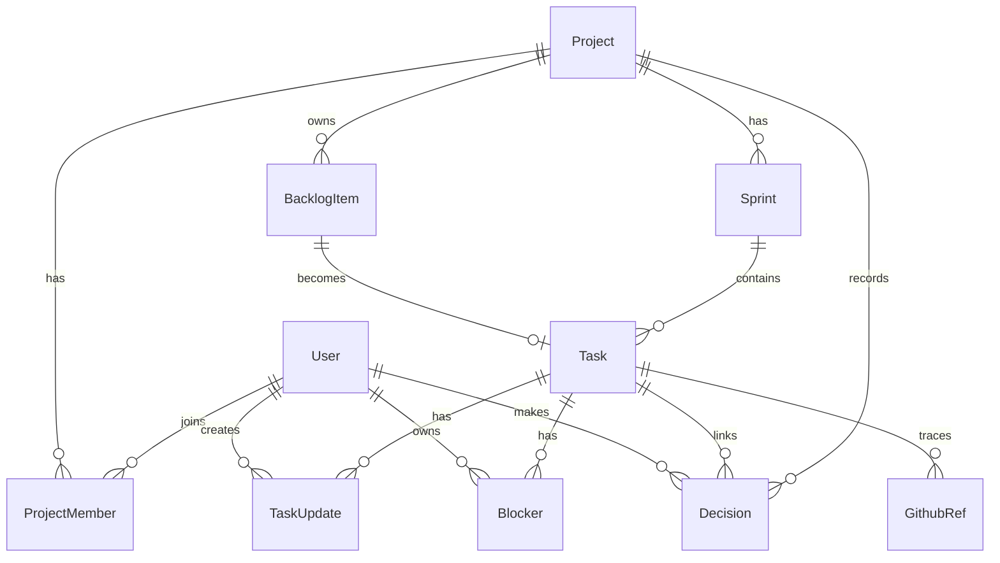
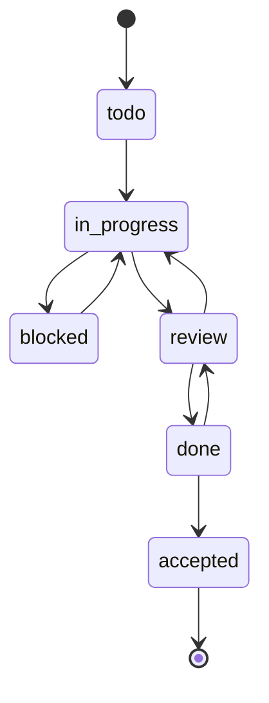

# AI Scrum Lite MVP 数据模型

## 1. 建模原则

MVP 数据模型围绕一个核心对象设计：

> Task / Story 是项目执行的中心。更新、阻塞、决策、GitHub refs、验收都应尽量挂到任务上。

关键原则：

- 数据库是唯一事实源。
- 每次状态变化都要留下更新记录。
- `Done` 和 `Accepted` 必须分开。
- AI Agent 和 Human 都是 Actor。
- GitHub 第一版只做 trace，不做深度同步。

## 2. 核心实体关系图



## 3. 枚举定义

### UserType

```text
human
ai
```

### ProjectRole

```text
owner
scrum_master
product
design
dev
qa
viewer
```

### ProjectStatus

```text
active
paused
archived
```

### SprintStatus

```text
planning
active
closed
cancelled
```

### BacklogItemType

```text
epic
story
task
bug
```

### Priority

```text
P0
P1
P2
P3
```

### BacklogStatus

```text
backlog
ready
in_sprint
done
archived
```

### TaskStatus

```text
todo
in_progress
blocked
review
done
accepted
```

### BlockerStatus

```text
open
resolved
ignored
```

### DecisionType

```text
product
technical
scope
acceptance
process
other
```

## 4. 表结构

### users

| 字段 | 类型 | 说明 |
|---|---|---|
| id | uuid | 主键 |
| name | string | 昵称或 Agent 名称 |
| email | string nullable | 人类用户邮箱 |
| image | string nullable | 头像 |
| type | UserType | human 或 ai |
| provider | string nullable | github、manual、agent |
| provider_account_id | string nullable | OAuth 账号 ID |
| created_at | datetime | 创建时间 |
| updated_at | datetime | 更新时间 |

### projects

| 字段 | 类型 | 说明 |
|---|---|---|
| id | uuid | 主键 |
| name | string | 项目名称 |
| description | text nullable | 项目说明 |
| goal | text nullable | 项目目标 |
| repo_url | string nullable | GitHub 仓库 URL |
| status | ProjectStatus | active、paused、archived |
| created_by_id | uuid | 创建人 |
| created_at | datetime | 创建时间 |
| updated_at | datetime | 更新时间 |

### project_members

| 字段 | 类型 | 说明 |
|---|---|---|
| id | uuid | 主键 |
| project_id | uuid | 项目 ID |
| user_id | uuid | 用户或 Agent ID |
| role | ProjectRole | 项目角色 |
| display_name | string nullable | 项目内展示名 |
| created_at | datetime | 创建时间 |
| updated_at | datetime | 更新时间 |

约束：

- 同一项目中，同一 user_id 只能出现一次。
- 一个项目必须至少有一个 owner。

### sprints

| 字段 | 类型 | 说明 |
|---|---|---|
| id | uuid | 主键 |
| project_id | uuid | 项目 ID |
| name | string | Sprint 名称，例如 Sprint 1 |
| goal | text nullable | Sprint Goal |
| status | SprintStatus | planning、active、closed、cancelled |
| start_date | date nullable | 开始日期 |
| end_date | date nullable | 结束日期 |
| created_at | datetime | 创建时间 |
| updated_at | datetime | 更新时间 |

约束：

- 一个项目同一时间建议只有一个 active Sprint。

### backlog_items

| 字段 | 类型 | 说明 |
|---|---|---|
| id | uuid | 主键 |
| project_id | uuid | 项目 ID |
| parent_id | uuid nullable | 父级 Epic 或 Story |
| title | string | 标题 |
| description | text nullable | 描述 |
| type | BacklogItemType | epic、story、task、bug |
| priority | Priority | P0-P3 |
| status | BacklogStatus | backlog、ready、in_sprint、done、archived |
| user_story | text nullable | 用户故事 |
| acceptance_criteria | text nullable | 验收标准 |
| created_by_id | uuid | 创建人 |
| created_at | datetime | 创建时间 |
| updated_at | datetime | 更新时间 |

### tasks

| 字段 | 类型 | 说明 |
|---|---|---|
| id | uuid | 主键 |
| project_id | uuid | 项目 ID |
| sprint_id | uuid | Sprint ID |
| backlog_item_id | uuid nullable | 来源 Backlog 条目 |
| title | string | 标题 |
| description | text nullable | 描述 |
| type | BacklogItemType | story、task、bug 等 |
| priority | Priority | P0-P3 |
| status | TaskStatus | todo 到 accepted |
| assignee_id | uuid nullable | 负责人 |
| user_story | text nullable | 用户故事 |
| acceptance_criteria | text nullable | 验收标准 |
| created_by_id | uuid | 创建人 |
| created_at | datetime | 创建时间 |
| updated_at | datetime | 更新时间 |
| started_at | datetime nullable | 首次进入 in_progress 的时间 |
| completed_at | datetime nullable | 首次进入 done 的时间 |
| accepted_at | datetime nullable | Owner 验收时间 |

### task_updates

| 字段 | 类型 | 说明 |
|---|---|---|
| id | uuid | 主键 |
| task_id | uuid | 任务 ID |
| actor_id | uuid | 更新人或 Agent |
| previous_status | TaskStatus nullable | 更新前状态 |
| new_status | TaskStatus nullable | 更新后状态 |
| progress | text | 进度说明 |
| blockers | json nullable | 阻塞摘要 |
| next_step | text nullable | 下一步 |
| artifacts | json nullable | 文件、链接、交付物 |
| needs_human_decision | boolean | 是否需要人工决策 |
| raw_payload | json nullable | Agent 原始提交 |
| created_at | datetime | 创建时间 |

说明：

- 任务详情页的时间线主要来自 task_updates。
- AI Agent 的结构化更新完整保存在 raw_payload 中，方便回溯。

### blockers

| 字段 | 类型 | 说明 |
|---|---|---|
| id | uuid | 主键 |
| project_id | uuid | 项目 ID |
| task_id | uuid nullable | 关联任务 |
| title | string | 阻塞标题 |
| description | text nullable | 阻塞说明 |
| status | BlockerStatus | open、resolved、ignored |
| owner_id | uuid nullable | 需要谁处理 |
| created_by_id | uuid | 创建人 |
| resolved_by_id | uuid nullable | 解决人 |
| resolved_at | datetime nullable | 解决时间 |
| created_at | datetime | 创建时间 |
| updated_at | datetime | 更新时间 |

### decisions

| 字段 | 类型 | 说明 |
|---|---|---|
| id | uuid | 主键 |
| project_id | uuid | 项目 ID |
| task_id | uuid nullable | 关联任务 |
| made_by_id | uuid | 决策人 |
| type | DecisionType | product、technical、scope 等 |
| title | string | 决策标题 |
| decision | text | 决策内容 |
| reason | text nullable | 决策原因 |
| impact | text nullable | 影响范围 |
| reversible | boolean | 是否可逆 |
| created_at | datetime | 创建时间 |
| updated_at | datetime | 更新时间 |

### github_refs

| 字段 | 类型 | 说明 |
|---|---|---|
| id | uuid | 主键 |
| project_id | uuid | 项目 ID |
| task_id | uuid | 任务 ID |
| branch | string nullable | 分支 |
| commit_hash | string nullable | Commit hash |
| pull_request_url | string nullable | PR URL |
| checks_status | string nullable | checks 状态文本 |
| note | text nullable | 备注 |
| created_by_id | uuid | 创建人或 Agent |
| created_at | datetime | 创建时间 |
| updated_at | datetime | 更新时间 |

### summaries

| 字段 | 类型 | 说明 |
|---|---|---|
| id | uuid | 主键 |
| project_id | uuid | 项目 ID |
| sprint_id | uuid nullable | Sprint ID |
| type | string | daily、review、retro |
| title | string | 摘要标题 |
| content | text | 摘要正文 |
| generated_by_id | uuid nullable | 生成者 |
| created_at | datetime | 创建时间 |
| updated_at | datetime | 更新时间 |

## 5. 状态流转规则

### Task 状态流转



规则：

- 任何角色都可以提交 task_update。
- Dev/QA 可以将任务推进到 `review` 或 `done`。
- 只有 Owner 可以将任务推进到 `accepted`。
- 进入 `blocked` 时必须填写 blocker。
- 进入 `accepted` 时必须写入 accepted_at。

## 6. Agent Update API 输入模型

第一版 Agent 或 OPC 协作者可以通过表单/API 提交统一结构：

```json
{
  "agent_role": "dev",
  "task_id": "TASK-001",
  "new_status": "review",
  "progress": "完成登录页和表单校验",
  "blockers": [],
  "artifacts": ["src/pages/Login.tsx"],
  "github": {
    "branch": "feature/TASK-001-login",
    "commits": ["a13f9c2"],
    "pull_request_url": "https://github.com/org/repo/pull/1"
  },
  "next_step": "等待 PO 验收",
  "needs_human_decision": false
}
```

写入逻辑：

1. 校验 actor 是否属于项目。
2. 校验角色是否允许更新该任务。
3. 写入 task_updates。
4. 如果 new_status 合法，更新 tasks.status。
5. 如果 blockers 非空，写入 blockers。
6. 如果 github 信息非空，写入 github_refs。
7. 更新 tasks.updated_at。

## 7. MVP 索引建议

建议建立索引：

- `projects.created_by_id`
- `project_members.project_id`
- `project_members.user_id`
- `sprints.project_id`
- `backlog_items.project_id`
- `tasks.project_id`
- `tasks.sprint_id`
- `tasks.status`
- `tasks.assignee_id`
- `task_updates.task_id`
- `blockers.project_id`
- `blockers.status`
- `decisions.project_id`
- `github_refs.task_id`

## 8. Prisma 建模注意点

后续用 Prisma 实现时建议：

- 所有 id 使用 `String @id @default(cuid())` 或 UUID。
- 所有 `created_at` 使用 `@default(now())`。
- 所有 `updated_at` 使用 `@updatedAt`。
- enum 使用 Prisma enum。
- JSON 字段用于 Agent 原始 payload、artifacts、blockers 摘要。
- 初期避免过度拆分权限表，先用 role 做服务端判断。
