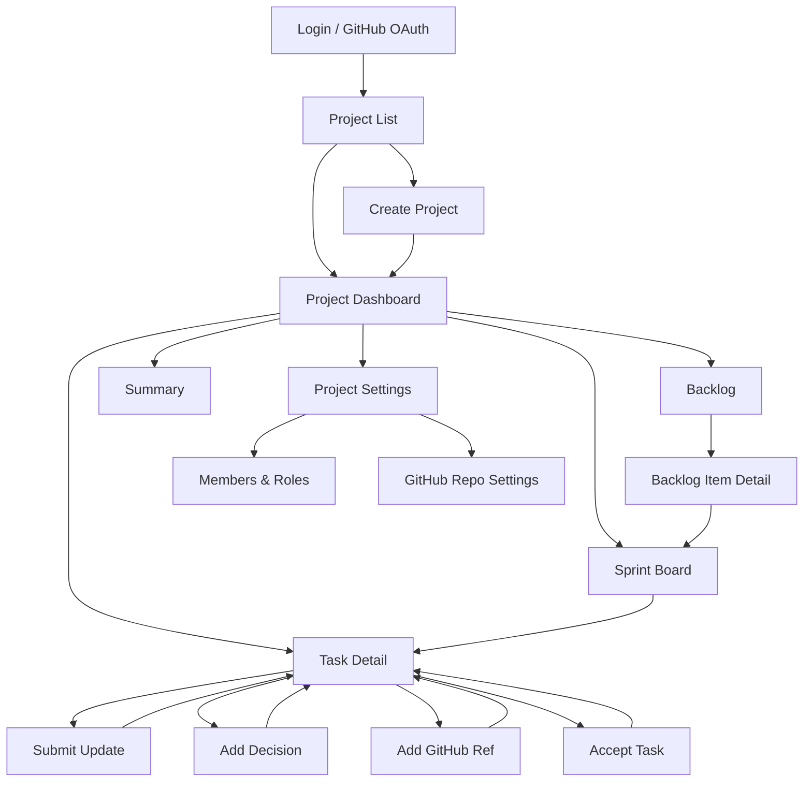
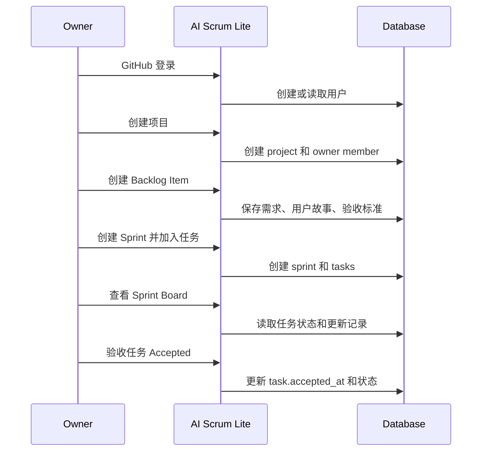
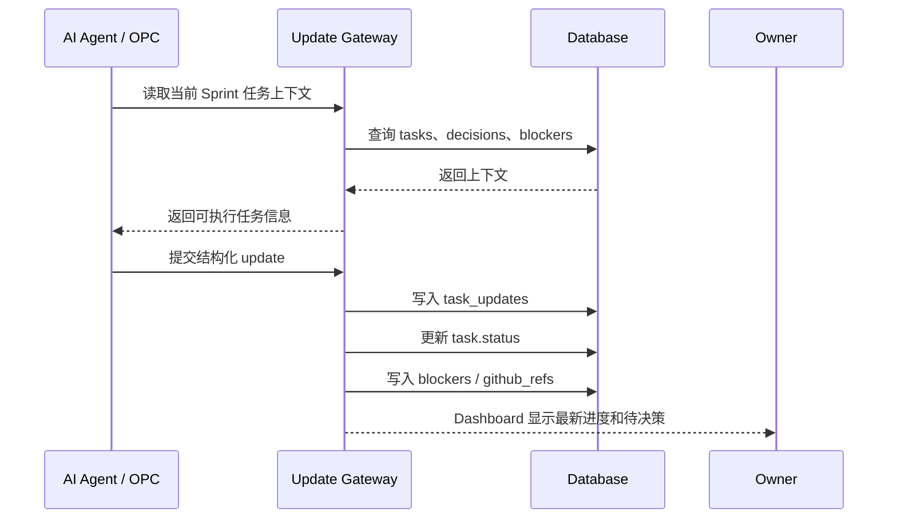
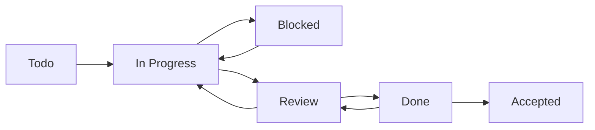
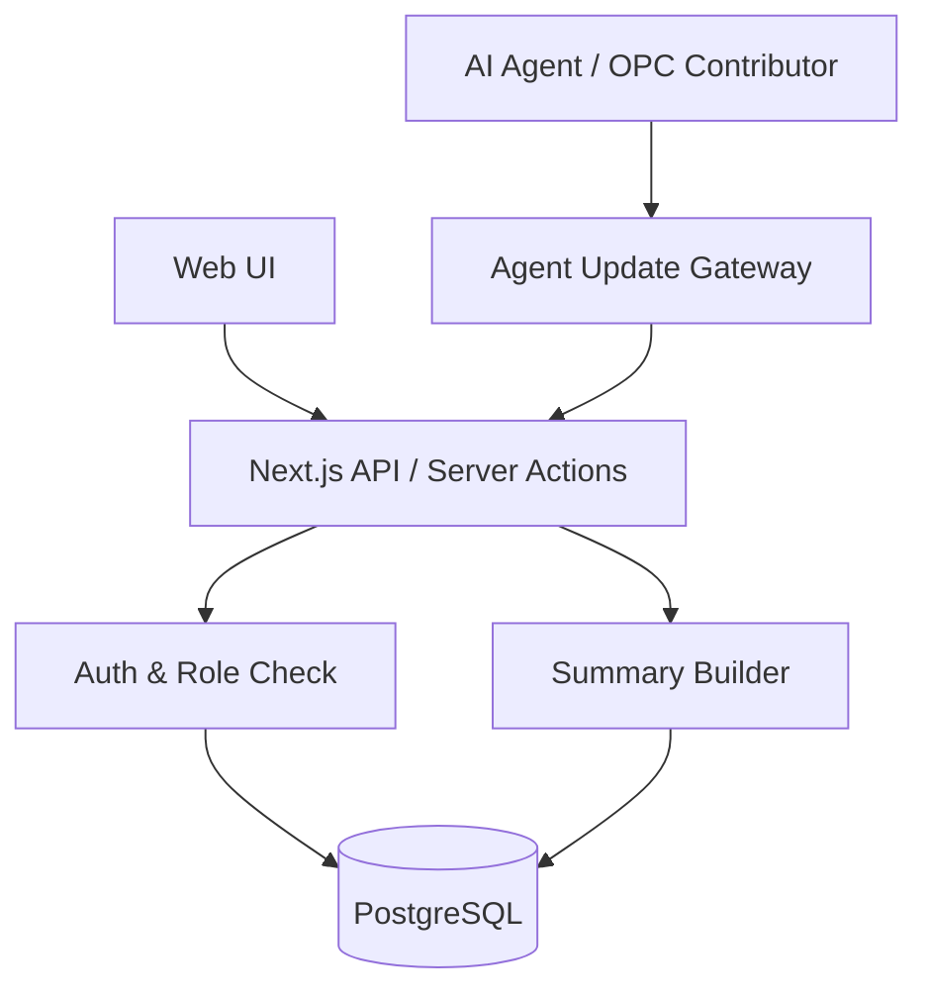

# AI Scrum Lite MVP 页面流转图

## 1. 页面结构总览



## 2. 主导航

登录后进入项目内，建议左侧导航包含：

```text
Dashboard
Backlog
Sprint Board
Summary
Settings
```

任务详情从 Backlog、Sprint Board、Dashboard 的列表中进入，不一定放在主导航里。

## 3. 页面说明

### 3.1 Login

目标：

- 通过 GitHub OAuth 登录。

页面元素：

- 产品名：AI Scrum Lite。
- GitHub 登录按钮。

登录后：

- 如果用户已有项目，进入 Project List。
- 如果没有项目，进入 Create Project 或 Project List 空状态。

### 3.2 Project List

目标：

- 查看自己参与的项目。
- 创建新项目。

页面元素：

- 项目卡片或列表。
- 项目名称。
- 当前 Sprint。
- 未解决阻塞数。
- 待验收任务数。
- 最近更新时间。
- 创建项目按钮。

流转：

```text
Project List → Project Dashboard
Project List → Create Project
```

### 3.3 Create Project

目标：

- 创建一个 AI/OPC 交付项目。

表单字段：

- Project Name。
- Description。
- Goal。
- GitHub Repo URL。

提交后：

- 创建项目。
- 当前用户自动成为 Owner。
- 进入 Project Dashboard。

### 3.4 Project Dashboard

目标：

- 让 Owner 一眼看到当前 Sprint 状态。

模块：

- 当前 Sprint Goal。
- 当前 Sprint 起止日期。
- 任务状态统计。
- Open Blockers。
- Pending Decisions。
- Awaiting Acceptance。
- Recent Updates。

关键操作：

- 创建 Sprint。
- 进入 Sprint Board。
- 进入 Backlog。
- 查看待验收任务。

### 3.5 Project Settings

目标：

- 管理项目信息、Repo URL、成员和 Agent。

模块：

- Project Info。
- GitHub Repo URL。
- Members & Roles。

成员字段：

- Name。
- Type：human / ai。
- Role。

MVP 操作：

- 添加 AI Agent。
- 修改角色。
- 移除成员。

### 3.6 Backlog

目标：

- 管理产品待办项。

页面元素：

- Backlog 列表。
- 类型筛选：Epic / Story / Task / Bug。
- 优先级筛选。
- 状态筛选。
- 创建 Backlog Item 按钮。

列表字段：

- Title。
- Type。
- Priority。
- Status。
- Assignee。
- Updated At。

关键操作：

- 新建 Epic/Story/Task/Bug。
- 编辑用户故事。
- 编辑验收标准。
- 加入当前 Sprint。

### 3.7 Backlog Item Detail

目标：

- 细化需求，使其可进入 Sprint。

字段：

- Title。
- Type。
- Priority。
- Description。
- User Story。
- Acceptance Criteria。
- Parent。
- Status。

关键操作：

- Save。
- Mark Ready。
- Add to Sprint。

### 3.8 Sprint Board

目标：

- 跑 Sprint 执行。

固定列：

```text
Todo
In Progress
Blocked
Review
Done
Accepted
```

任务卡片字段：

- Title。
- Priority。
- Assignee。
- Last Updated。
- GitHub PR 标识。
- Blocker 标识。

关键操作：

- 拖动或按钮更新状态。
- 点击进入 Task Detail。
- 快速提交 Update。

### 3.9 Task Detail

目标：

- 任务执行事实源。

页面结构：

```text
任务基础信息
验收标准
当前状态
负责人
GitHub refs
Blockers
Decision Log
Update Timeline
```

关键操作：

- Submit Update。
- Add Blocker。
- Add Decision。
- Add GitHub Ref。
- Move to Review。
- Mark Done。
- Accept。

权限：

- Owner 才能 Accept。
- Agent 可以 Submit Update。
- Dev/QA 可以提交 GitHub refs。

### 3.10 Submit Update

目标：

- 让 AI Agent、OPC 协作者或人类成员提交结构化进度。

表单字段：

- New Status。
- Progress。
- Blockers。
- Next Step。
- Artifacts。
- Branch。
- Commit Hash。
- Pull Request URL。
- Needs Human Decision。

提交后：

- 创建 TaskUpdate。
- 更新任务状态。
- 必要时创建 Blocker。
- 必要时创建 GitHubRef。
- 回到 Task Detail。

### 3.11 Summary

目标：

- 支持 Daily Scrum、Sprint Review、Retro。

页面模块：

- Daily Summary。
- Sprint Review。
- Retro Notes。

Daily Summary 内容：

- 最近完成。
- 今日建议推进。
- 当前阻塞。
- 待决策。
- 待验收。

MVP 可先使用规则生成，不强依赖 AI API：

- 从 task_updates 汇总最近更新。
- 从 blockers 汇总 open blockers。
- 从 tasks 汇总 review/done 待验收。
- 从 decisions 汇总近期决策。

## 4. Owner 核心路径



## 5. AI Agent / OPC 更新路径



## 6. 状态流转图



关键规则：

- `Blocked` 必须有阻塞说明。
- `Review` 表示等待检查。
- `Done` 表示执行者认为完成。
- `Accepted` 表示 Owner 已验收。

## 7. MVP API 流转



最小 API：

```text
GET    /api/projects
POST   /api/projects
GET    /api/projects/:projectId/dashboard
POST   /api/projects/:projectId/members
GET    /api/projects/:projectId/backlog
POST   /api/projects/:projectId/backlog
POST   /api/projects/:projectId/sprints
GET    /api/sprints/:sprintId/board
GET    /api/tasks/:taskId
PATCH  /api/tasks/:taskId
POST   /api/tasks/:taskId/updates
POST   /api/tasks/:taskId/decisions
POST   /api/tasks/:taskId/github-refs
GET    /api/sprints/:sprintId/summary
```

## 8. 第一版交互优先级

P0 必须先完成：

- 登录。
- 创建项目。
- 创建角色/Agent。
- 创建 Backlog。
- 创建 Sprint。
- Sprint Board。
- Task Detail。
- Submit Update。
- Accepted 验收。

P1 再完成：

- Summary 页面。
- GitHub refs 优化展示。
- Dashboard 指标优化。

P2 以后：

- GitHub webhook。
- MCP Server。
- AI 自动生成总结。
- 自定义流程。
